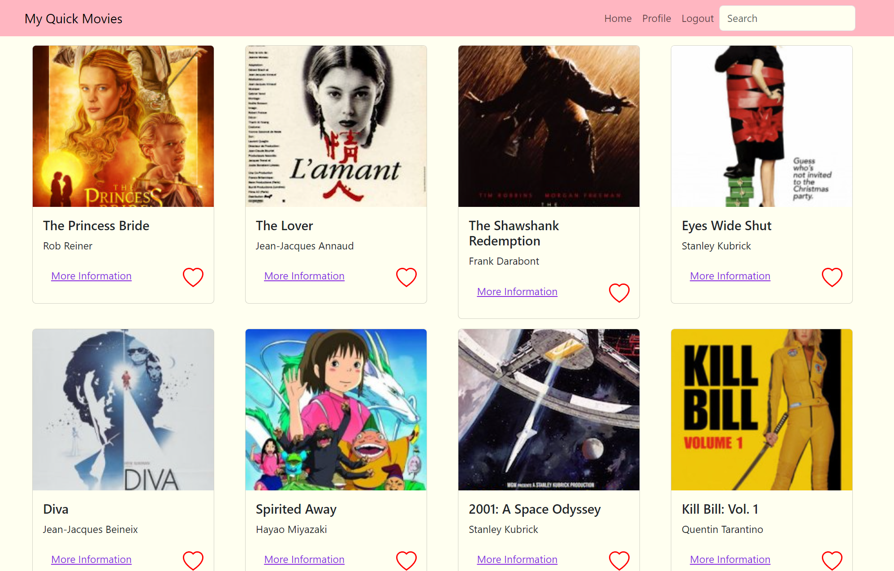

# myFlix Client App

## Description
This application is where users can create an account, view all the movies, check the movie description, director and genre information and choose to add or delete a movie into the favorite movie list.
The user can update their information or cancel the account.
This client-side app is written in React, based on its existing server-side code (REST API and dtatabase). 

## Link to the App
https://myquickmovies.netlify.app

## API Hosted
https://myquickmovieapi.onrender.com

## Screenshot of the App

## Essential Features
- Returns all movies to the user (each movie item with an image, title, and description)
- Filters the list of movies with a "search" feature
- Ability to select a movie for more details
- Ability to log out
- Ability to navigate to Profile view
- Returns data (description, genre, director, image) about a single movie to the user
- Allows users to add a movie to their list of favorites
- Allows users to log in with a username and password
- Allows new users to register (username, password, email, date of birth)
- Displays user registration details
- allows users to update their info (username, password, email, date of birth)
- Displays favorite movies
- Allows existing users to deregister
- Returns data about a genre, with a name and description
- Returns data about a director (name, bio, birth year, death year)

## Technical Requirements
- The application is a single-page application (SPA)
- The application uses state routing to navigate between views and share URLs
- The application gives users the option to filter moviews using a "search" feature
- The application uses Parcel as its build tool
- The application is written using the React library and in ES2015+
- The application uses Bootstrap as a UI library for styling and responsiveness
- The application contains function components
- The application is hosted online
- The application uses REact REdux for state management of at least one feature (i.e. filtering movies)

## Dependencies
		bootstrap
    prop-types
    react
    react-bootstrap
    react-dom
    react-router
    react-router-dom
		@parcel/transformer-sass
    parcel
    process

